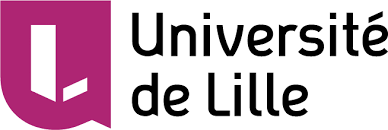

Scratch au collège
==================

Vous êtes parent et votre enfant s'intéresse à Scratch ? Vous êtes professeur de mathématiques et vous enseignez la programmation en classe ? Vous êtes juste curieux de découvrir comment programmer un ordinateur ?

Ce livre "Scratch au collège" est pour vous !

Le premier objectif de ce livre, c'est d'apprendre à programmer : Scratch est le logiciel idéal pour débuter. Nous vous proposons un parcours progressif avec des énigmes ludiques pour tester vos connaissances.

Le second objectif est d'approfondir vos connaissances des algorithmes à l'aide d'activités débranchées. En travaillant sur feuille vous découvrirez des algorithmes géométriques, des algorithmes sur les mots, l'écriture binaire des nombres et plein d'autres choses !

Ce livre est idéal pour vous accompagner dans la découverte de la programmation. Il se complète par des ressources en ligne : des vidéos et des fiches en couleurs.

Vidéos
======

Les vidéos sont visible depuis la chaîne *Youtube* [Scratch au collège](http://www.youtube.com/ScratchAuCollege "www.youtube.com/ScratchAuCollege").

Les vidéos utilisent la version 2 de Scratch, il peut y avoir des variations d'une version à l'autre, mais les principes généraux restent les mêmes. 

Livre
=====

Le livre est en vente sur Amazon.fr à prix coûtant. [Commander le livre sur Amazon.fr](https://www.amazon.fr/dp/B092P76LYN).

Vous pouvez aussi le téléchargez sur ce site : [Livre 'Scratch au collège' (4 Mo)](livre-scratch3.pdf).

Activités Scratch
=================

* Premiers pas - [Activités](fiche01/scratch-01.pdf) - [Enigmes](fiche01/enigme-01.pdf)

* Répéter - [Activités](fiche02/scratch-02.pdf) - [Enigmes](fiche02/enigme-02.pdf)

* Coordonnées x, y - [Activités](fiche03/scratch-03.pdf) - [Enigmes](fiche03/enigme-03.pdf)

* Si... alors... - [Activités](fiche04/scratch-04.pdf) - [Enigmes](fiche04/enigme-04.pdf)

* Entrée/Sortie - [Activités](fiche05/scratch-05.pdf) - [Enigmes](fiche05/enigme-05.pdf)

* Variables et hasard - [Activités](fiche06/scratch-06.pdf) - [Enigmes](fiche06/enigme-06.pdf)

* Si... alors... sinon... - [Activités](fiche07/scratch-07.pdf) - [Enigmes](fiche07/enigme-07.pdf)

* Plusieurs lutins - [Activités](fiche08/scratch-08.pdf) - [Enigmes](fiche08/enigme-08.pdf)

* Sons - [Activités](fiche09/scratch-09.pdf) - [Enigmes](fiche09/enigme-09.pdf)

* Invasion - [Activités](fiche10/scratch-10.pdf) - [Enigmes](fiche10/enigme-10.pdf)

* Créer ses blocs - [Activités](fiche11/scratch-11.pdf) - [Enigmes](fiche11/enigme-11.pdf)

* Listes - [Activités](fiche12/scratch-12.pdf) - [Enigmes](fiche12/enigme-12.pdf)

Solutions
=========

Vous trouverez tous les programme *Scratch* solutions à la fin de chaque chapitre du livre et aussi en naviguant dans les dossiers : [Source sur GitHUB](https://github.com/exo7math/scratch3-exo7). Les fichiers *Scratch* ont une extension *sb3*.

Activités débranchées
=====================

* Premiers pas - [Activités](premiers_pas/premiers_pas.pdf)
* Répéter - [Activités](repeter/repeter.pdf)
* Opérations algébriques I - [Activités](operations_algebriques_1/operations_algebriques_1.pdf)
* Vrai et faux - [Activités](vrai_faux/vrai_faux.pdf)
* Opérations algébriques II - [Activités](operations_algebriques_2/operations_algebriques_2.pdf)
* Si... alors... - [Activités](si_alors/si_alors.pdf)
* Boucles I - [Activités](boucles_1/boucles_1.pdf)
* Chercher et remplacer - [Activités](chercher/chercher.pdf)
* Puissances de 2 - [Activités](puissances_de_2/puissances_de_2.pdf)
* Binaire - [Activités](binaire/binaire.pdf)
* Boucles II - [Activités](boucles_2/boucles_2.pdf)
* Graphes - [Activités](graphe/graphe.pdf)
* Bases de données - [Activités](base_de_donnees/base_de_donnees.pdf)
* Pixels - [Activités](pixels/pixels.pdf)
* Diviser pour régner - [Activités](diviser_pour_regner/diviser_pour_regner.pdf)
* Couleurs - [Activités](couleurs/couleurs.pdf)
* Cryptographie - [Activités](crypto/crypto.pdf)
* Triangulation - [Activités](triangulation/triangulation.pdf)
* Distance entre deux mots - [Activités](distance_mots/distance_mots.pdf)

Auteurs
=======

Ce travail est issu du mooc *Scratch au collège* diffusé au printemps 2017 par une équipe formée de :

 * Arnaud Bodin
 * Loïc Arsicaud
 * Nathalie Bernard
 * François Recher

Les activités Scratch ont été écrites par Arnaud Bodin et validées par l'équipe.

Les activités débranchées ont été écrites par Arnaud Bodin et relues par Stéphanie Bodin et François Recher. Nous remercions Laurence Le Foll et Raphaël Petit pour leur relecture.

Nous remercions l'équipe du service multimédia de l'université de Lille pour son travail, en particulier Damien Deltombe pour la réalisation des vidéos, Téodorina Tibar pour l'ingénierie pédagogique et Yannick Bonnaz pour le graphisme. Merci à Christian Tellechea pour son extension LaTeX *Scratch3*.

Institutions
============

Ce projet est porté par le site Exo7 et l'IREM de Lille. 
Nous avons bénéficié du soutien de l'université de Lille, de la COMUE Lille Nord de France et d'une bourse Google CS4HS (*Computer Science for High School*).

